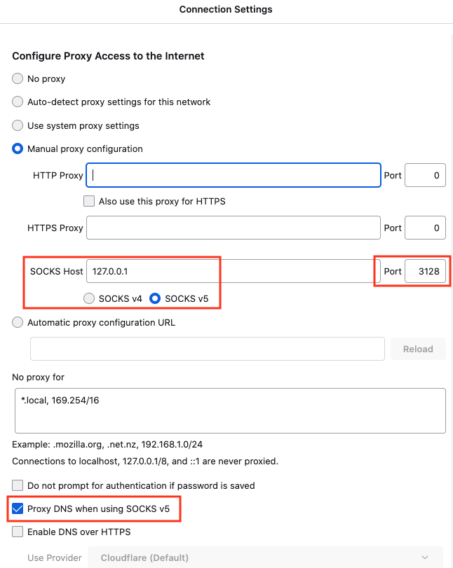
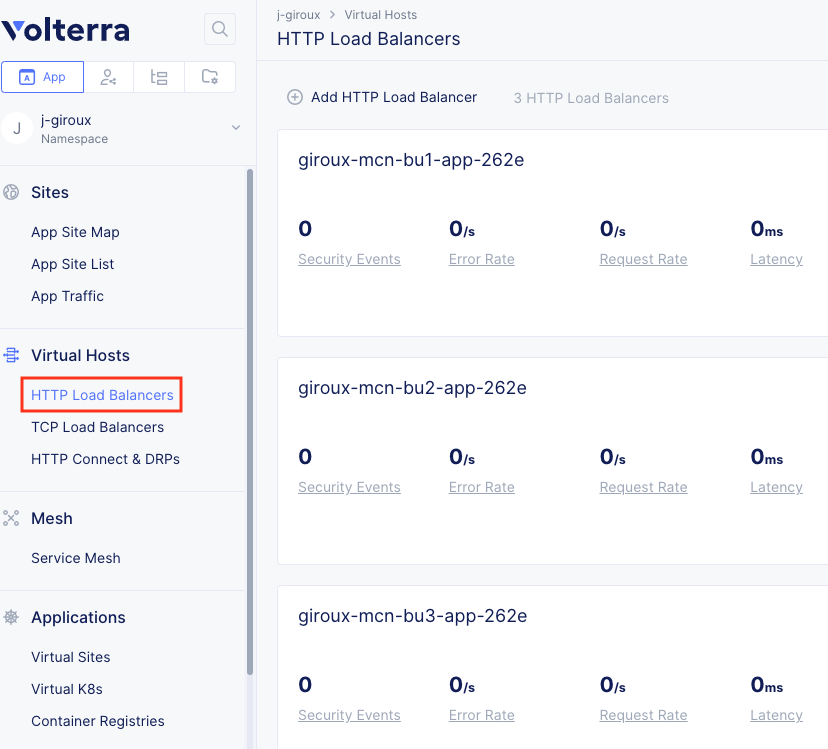
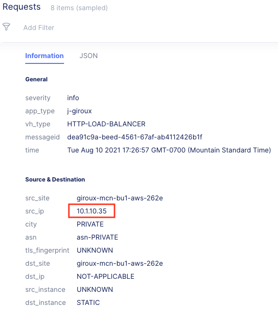

# Description
AWS accounts with overlapping ip addresses services connectivity

## Diagram


## Requirements

- AWS CLI
- Terraform
- AWS account, access and secret key
- Volterra account
- Volterra p12 credential file and api password -  https://www.volterra.io/docs/how-to/user-mgmt/credentials
- Volterra Cloud Credentials

## Login to AWS Environment

- Set AWS environment variables
```bash
export AWS_ACCESS_KEY_ID="your_key"
export AWS_SECRET_ACCESS_KEY="your_secret_key"
```

## Create Volterra Cloud Credentials for AWS

In VoltConsole go to the "System" namespace and navigate to "Manage" -> "Site Management" -> "Cloud Credentials".

Click on "Add Cloud Credential"

For the name enter "[unique-name]-aws".

For the Cloud Credential Type: "AWS Programmatic Access Credentials" and enter the values from your AWS access key and secret access key

- Access Key ID: This is your IAM user access key (reference AWS_ACCESS_KEY_ID)
- Secret Access Key: This is your IAM user secret access key (reference AWS_SECRET_ACCESS_KEY)

Under Secret Access Key click on "Configure"

Enter the value from environment variable AWS_SECRET_ACCESS_KEY and then click on "Blindfold"

## Usage example

- Clone the repo and open the solution's directory
```bash
git clone https://github.com/f5devcentral/f5-digital-customer-engagement-center
cd f5-digital-customer-engagement-center/solutions/security/multi-cloud-connectivity-volterra/
```

- Set Volterra environment variables
Create a Volterra credentials p12 file and copy it to a local folder. Follow steps here - https://www.volterra.io/docs/how-to/user-mgmt/credentials

```bash
export VES_P12_PASSWORD="your_key"
export VOLT_API_URL="https://<tenant-name>.console.ves.volterra.io/api"
export VOLT_API_P12_FILE="/var/tmp/<example>.console.ves.volterra.io.api-creds.p12"
```

- Get the Volterra tenant name
General namespace in the VoltConsole UI, then Tenant Settings > Tenant overview

- Create the tfvars file and update it with your settings

```bash
cp admin.auto.tfvars.example admin.auto.tfvars
# MODIFY TO YOUR SETTINGS
vi admin.auto.tfvars
```

- Run the setup script to deploy all of the components into your AWS account (remember that you are responsible for the cost of those components)

```bash
./setup.sh
```

## TEST your setup:

1. Connect to the bu1Jumphost via SSH with port forwarding enabled.

The IP is in the terraform output. Example SSH command is below. Run this from your laptop terminal. You will use these settings later in your laptop web browser to configure SOCKS v5 proxy.

```bash
# run this from your laptop/pc
ssh -D 3128 ubuntu@x.x.x.x
# port = 3128
# user = ubuntu
# IP = x.x.x.x
```

2. From the jumphost CLI, test curl commands to each BU site.

```bash
# run this from the jumphost terminal
curl bu1app.shared.acme.com
curl bu2app.shared.acme.com
curl bu3app.shared.acme.com
```

3. On your laptop/PC, configure your browser to use 127.0.0.1:3128 as SOCKS v5 proxy and also enable the box "Proxy DNS when using SOCKS v5".



4. Browse to the BU sites. AWS will resolve with a basic NGINX page.


5. Open VoltConsole, go to the 'HTTP Load Balancers' tab



6. Click on bu1app and open the 'Requests' tab. You should see your request.


7. Click on the request and notice it shows the original clientIp and the source site.



## Cleanup
Use the following command to destroy all of the resources

```bash
./destroy.sh
```

## How to Contribute

Submit a pull request

# Authors
- Yossi Rosenboim
- Jeff Giroux
